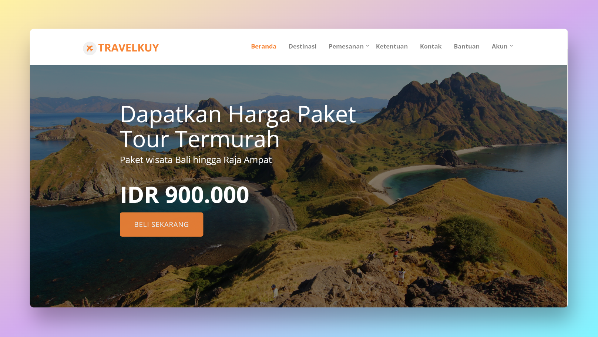

# TravelKuy



Travelkuy adalah situs penyedia paket travel di Indonesia.

  - Dibuat menggunakan PHP Native
  - Bootstrap 4.x
 
Support PHP 8.2
## Installation
```bash
git clone https://github.com/ir001/php-travelkuy.git && cd php-travelkuy.git
```
### Configure database authentication
Edit `system\config.php` file
```php
define('DB_HOST', 'localhost'); 
define('DB_USER', 'root');  //Change your username
define('DB_PASSWD', 'root');  //Change your password
define('DB_NAME', 'travelkuy'); 
```
### Import database
```bash
mysql -u root -p
```
```sql
create database travelkuy;
```
```bash
mysql -u root -p travelkuy < DB/db_pariwisata.sql
```

## Contact Me
[Facebook](https://www.facebook.com/ir001.id)
[Instagram](https://www.instagram.com/hjkwz)
[LinkedIn](https://id.linkedin.com/in/irwan-antonio)

